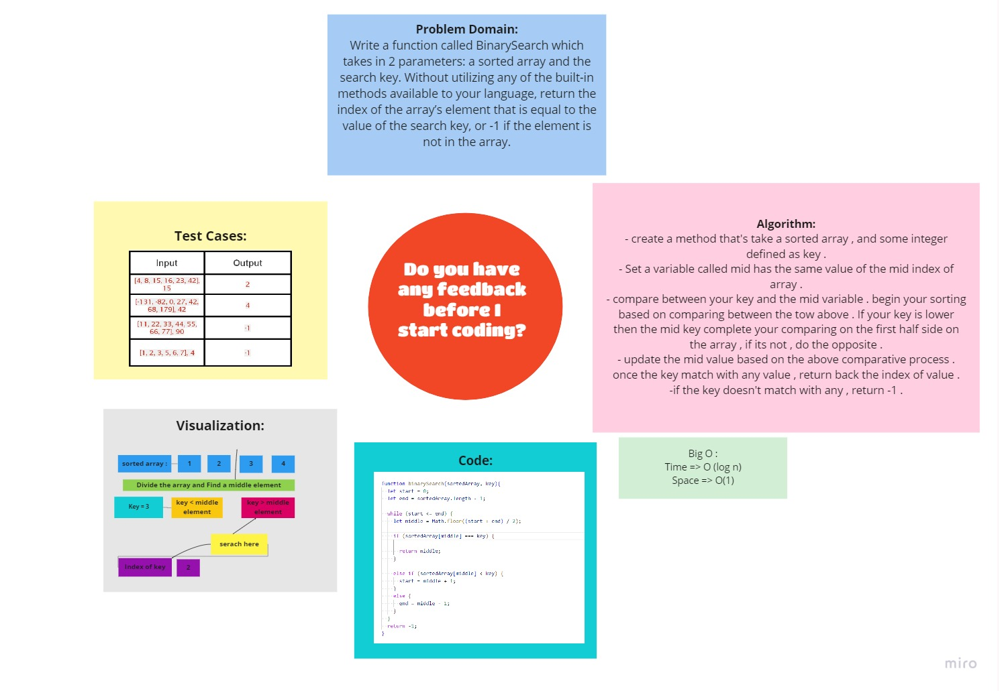

# Binary Search of Sorted Array
<!-- Description of the challenge -->

function called BinarySearch which takes in 2 parameters: a sorted array and the search key. Without utilizing any of the built-in methods available to your language, return the index of the array’s element that is equal to the value of the search key, or -1 if the element is not in the array.

## Whiteboard Process
<!-- Embedded whiteboard image -->

## Approach & Efficiency
<!-- What approach did you take? Discuss Why. What is the Big O space/time for this approach? -->

The time complexity of the Binary Search is O(logn), where n is the number of elements in the array. This is far better compared to the Linear Search, which is of time complexity O(n). Like many other search algorithms, Binary Search is an in-place algorithm. That means that it works directly on the original array without making any copies.

Binary Search is simple, intuitive and efficient logic and implementation make it a very popular algorithm to demonstrate the divide-and-conquer strategy.

## [Back To Home](../../README.md)
