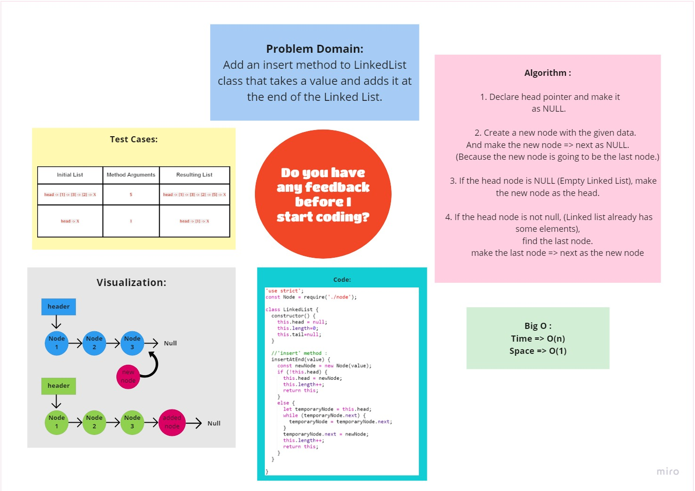
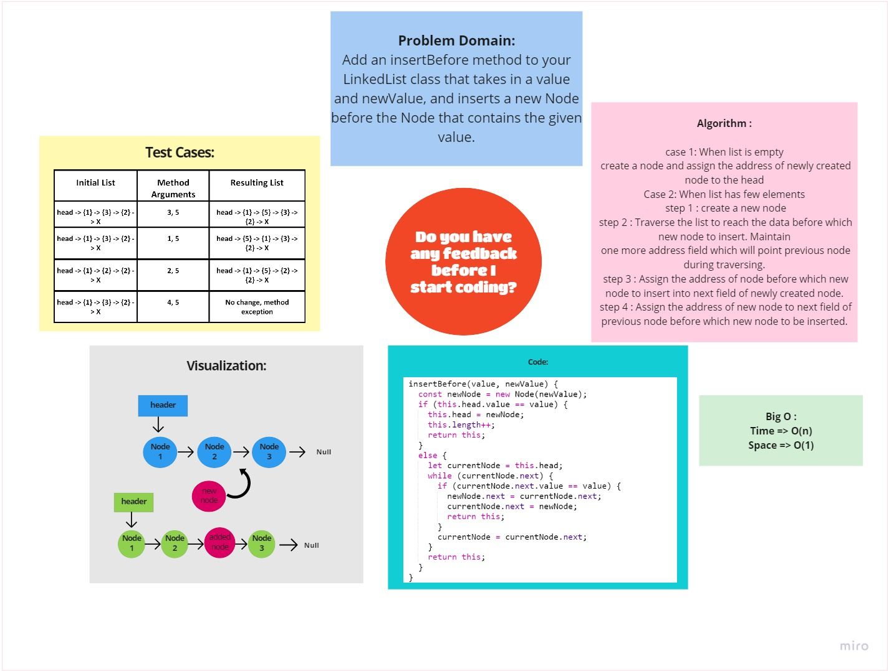

# Linked list insertions

# Challenge Summary
<!-- Description of the challenge -->
1. Add an insert method to LinkedList class that takes a value and adds it at the end of the Linked List.
2. Add an insertBefore method to your LinkedList class that takes in a value and newValue, and inserts a new Node before the Node that contains the given value.
3. Add an insertAfter method to your LinkedList class that takes in a value and newValue, and inserts a new Node after the Node that contains the given value.

## Whiteboard Process
<!-- Embedded whiteboard image -->
### **Insert At End of Linked List Method :**
 

### **Insert Before certain Node in Linked List Method :**

 

## Approach & Efficiency
<!-- What approach did you take? Why? What is the Big O space/time for this approach? -->

 The approach for all these methods involves iterating over the Nodes in the Linked List until reaching the given position where the new Node needs to be inserted. The new Node is then created and inserted into the list by updating other Nodes next value where necessary. All three of these functions take O(n) time and O(1) space.

## Solution
<!-- Show how to run your code, and examples of it in action -->

## [Back To Home](../../README.md)
