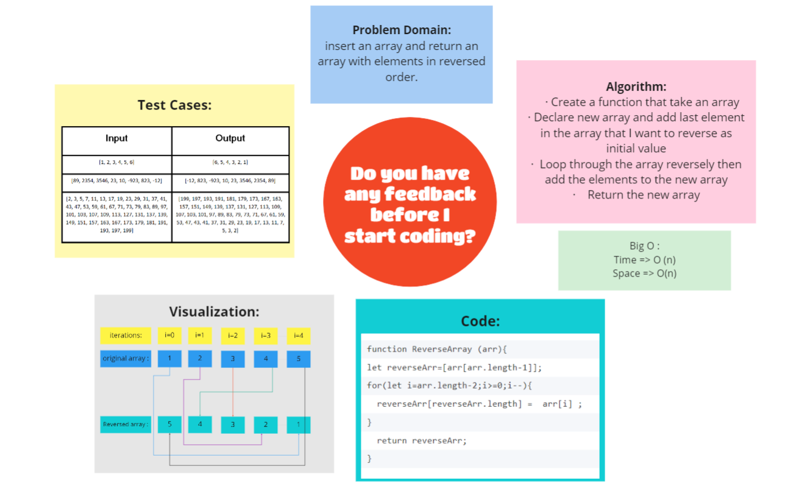

# Reverse an Array
<!-- Description of the challenge -->
Write a function called reverseArray which takes an array as an argument. Without utilizing any of the built-in methods available to Java Script, return an array with elements in reversed order.

## Whiteboard Process


<!-- Embedded whiteboard image -->

## Approach & Efficiency
<!-- What approach did you take? Discuss Why. What is the Big O space/time for this approach? -->
Big O :

Time => O(n) because looping through n (length of array)

Space => O(n) because we declared an array of size n


 Below another approach that could be use to solve the problem  by using some bulid in methods that make the code easiar and shorter like unshif() and map() instead of for Loop

```
function Reverse (arr){
let reverseArr=[];
 arr.map (element=>reverseArr.unshift(element));
  return reverseArr;
}
```


## [Back To Home](../../../README.md)

