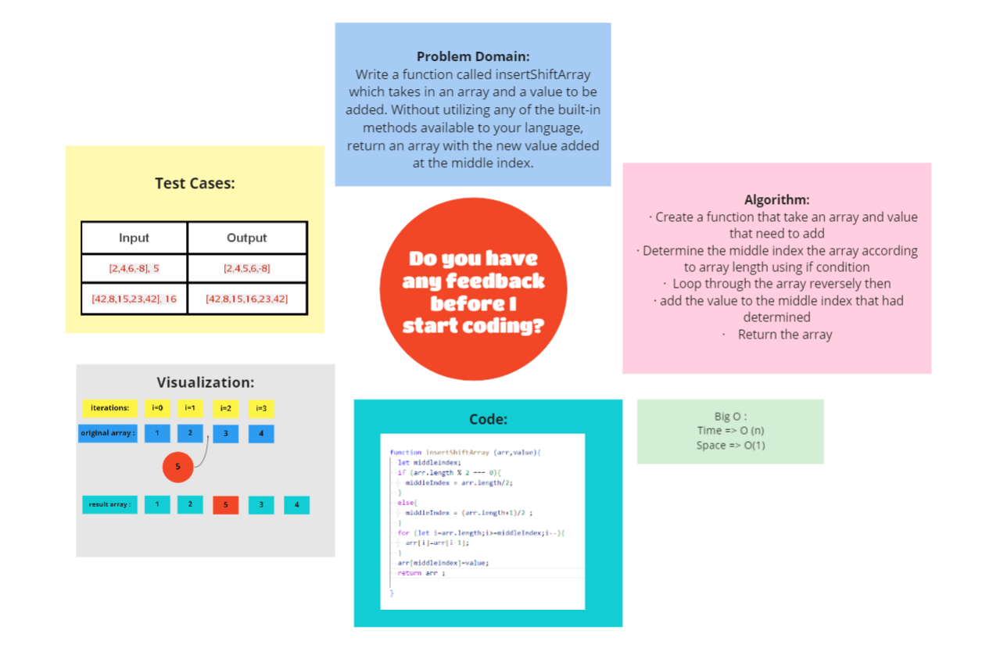

# Insert to Middle of an Array
<!-- Description of the challenge -->
Write a function called insertShiftArray which takes in an array and a value to be added. Without utilizing any of the built-in methods available to your language, return an array with the new value added at the middle index

## Whiteboard Process :
 

<!-- Embedded whiteboard image -->

## Approach & Efficiency
<!-- What approach did you take? Discuss Why. What is the Big O space/time for this approach? -->
Big O :

Time => O(n) because looping through n (length of array)

Space => O(1) because we use 1 extra space so its constant

## [Back To Home](../../../README.md)

