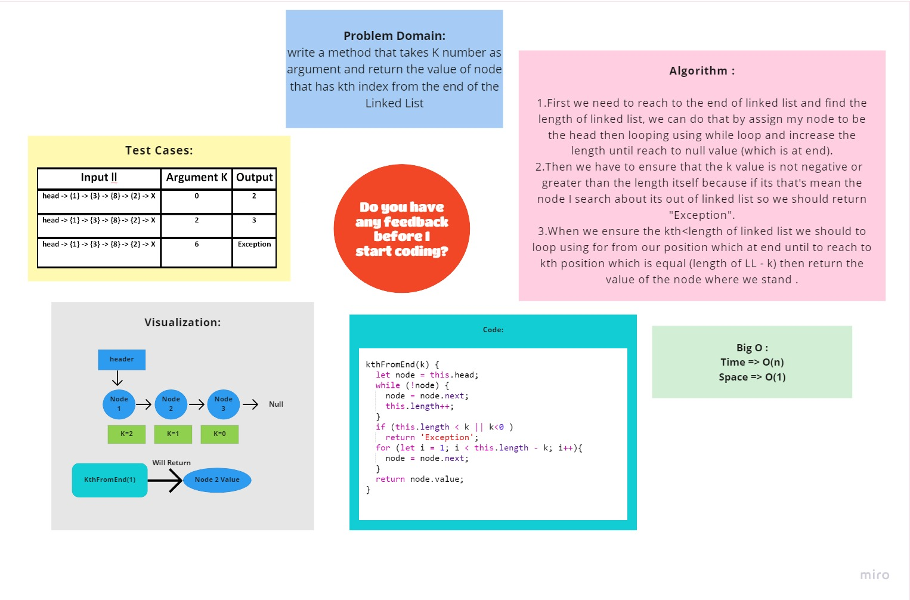

# K-th value from the end of a linked list

# Challenge Summary
<!-- Description of the challenge -->
write a method that takes K number as argument and return the value of node that has kth index from the end of the Linked List

## Whiteboard Process
<!-- Embedded whiteboard image -->
 

## Approach & Efficiency
<!-- What approach did you take? Why? What is the Big O space/time for this approach? -->

The approach for this method was to start by looking at the head of the list, and then loop until to reach to end of list which has null value.Then traverse reverse until to reach Kth node then return the node value.

 - The time of this method is O(n) and the space is O(1).

