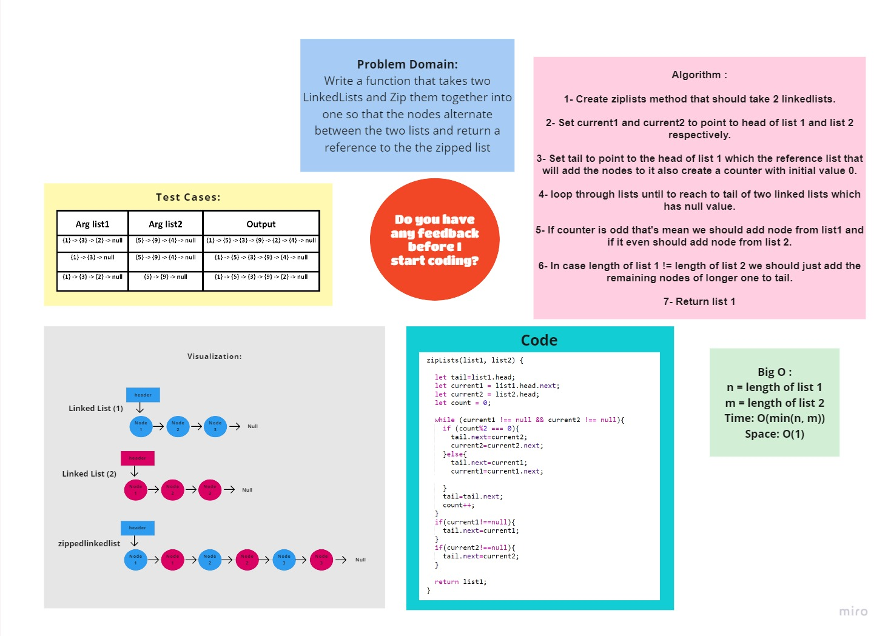

# linked-list-zip

# Challenge Summary
<!-- Description of the challenge -->
Write a function that takes two LinkedLists and Zip them together into one so that the nodes alternate between the two lists and return a reference to the the zipped list

## Whiteboard Process
<!-- Embedded whiteboard image -->
 

## Approach & Efficiency
<!-- What approach did you take? Why? What is the Big O space/time for this approach? -->
### **Big O :**

n = length of list 1

m = length of list 2

Time: O(min(n, m))

Space: O(1)

## [Back To Home](../../../README.md)

