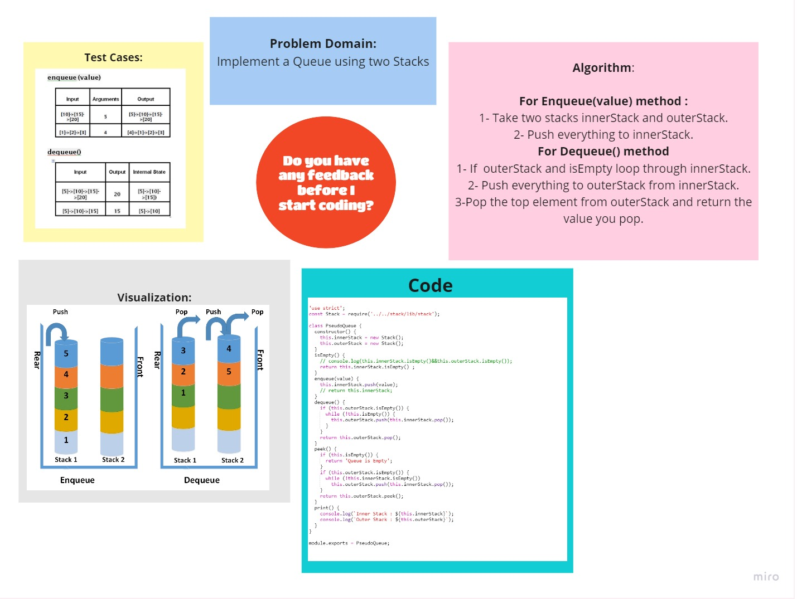

# Challenge Summary
<!-- Description of the challenge -->

### Implement a Queue using two Stacks
- Create a new class called pseudo queue.
- Do not use an existing Queue.
Instead, this PseudoQueue class will implement our standard queue interface (the two methods listed below)
Internally, utilize 2 Stack instances to create and manage the queue
- Methods:
  - enqueue
    - Arguments: value
    - Inserts value into the PseudoQueue, using a first-in, first-out approach.
  - dequeue
    - Arguments: none
    - Extracts a value from the PseudoQueue, using a first-in, first-out approach.

## Whiteboard Process
<!-- Embedded whiteboard image -->

 

## Approach & Efficiency
<!-- What approach did you take? Why? What is the Big O space/time for this approach? -->

### Time Complexity: O(N) for dequeue and O(1) for enqueue.

### Space Complexity: O(N)

## Solution
<!-- Show how to run your code, and examples of it in action -->
### [**Code**](./queue/lib/PseudoQueue.js)

## [Back To Home](../../../README.md)
