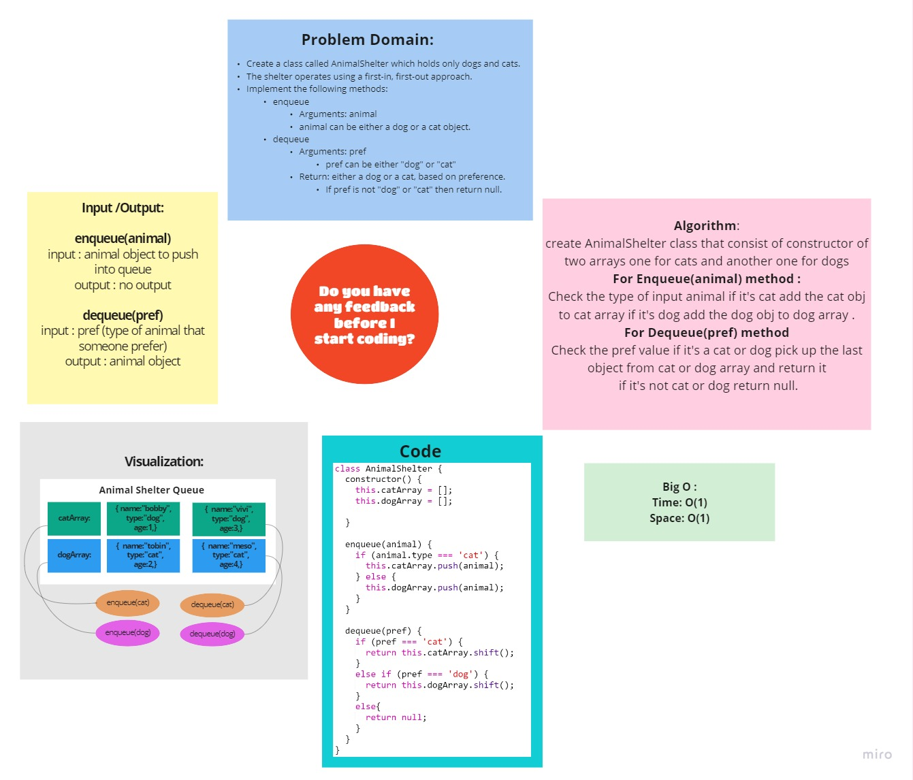

# First-in, First out Animal Shelter

# Challenge Summary
<!-- Description of the challenge -->

### Create a class called AnimalShelter which holds only dogs and cats.

- The shelter operates using a first-in, first-out approach.
- Implement the following methods:
  - enqueue
    - Arguments: `animal`
  animal can be either a dog or a cat object.
  - dequeue
    - Arguments: pref
  `pref` can be either `"dog"` or `"cat"`
  Return: either a dog or a cat, based on preference.
    - If `pref` is not `"dog"` or `"cat" `then return null.

## Whiteboard Process
<!-- Embedded whiteboard image -->

 

## Approach & Efficiency
<!-- What approach did you take? Why? What is the Big O space/time for this approach? -->

### Time Complexity : O(1)

### Space Complexity : O(1)

## Solution
<!-- Show how to run your code, and examples of it in action -->
### [**Code**](./AnimalShelter_queue/AnimalShelter.js)
