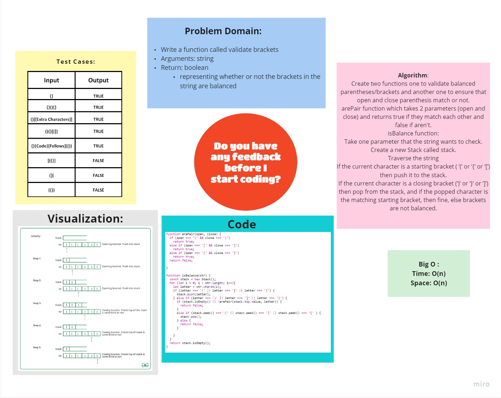

# Multi-bracket Validation

# Challenge Summary
<!-- Description of the challenge -->
Write a method named multiBracketValidation that, given a string, returns true or false if that string has balanced brackets.

## Whiteboard Process
<!-- Embedded whiteboard image -->

## Approach & Efficiency
<!-- What approach did you take? Why? What is the Big O space/time for this approach? -->
 

### **Big O** :

Time >>>> O(n)

Space >>>> O(n)

## Solution
<!-- Show how to run your code, and examples of it in action -->
 ### [**Code**](./bracket_validator.js)

## [Back To Home](../../../README.md)
