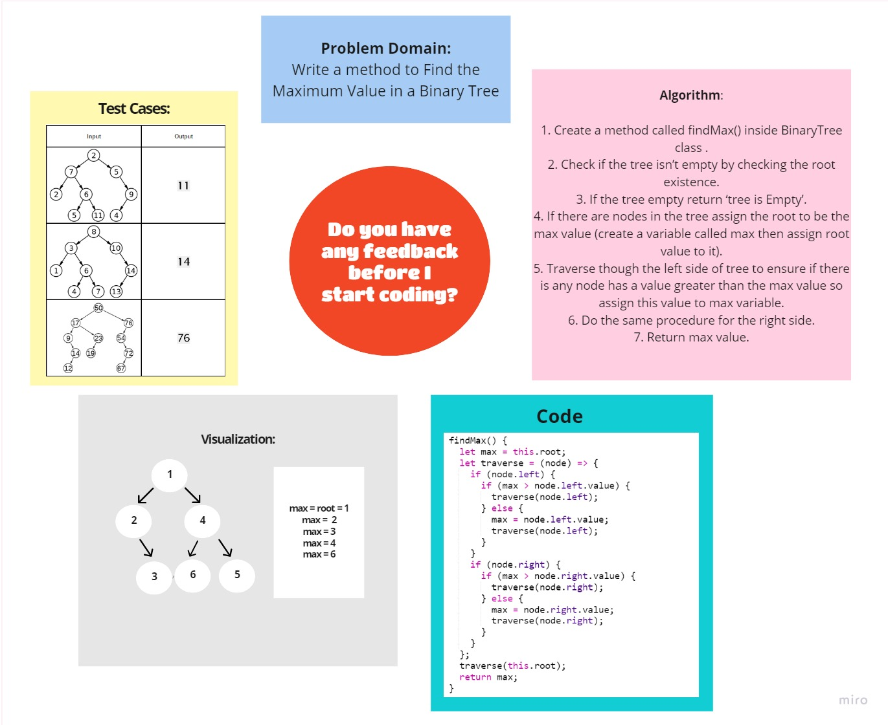

# Challenge Summary
<!-- Description of the challenge -->
### Find the Maximum Value in a Binary Tree

## Whiteboard Process
<!-- Embedded whiteboard image -->
 

## Approach & Efficiency
<!-- What approach did you take? Why? What is the Big O space/time for this approach? -->

### **Big O :**

**Time Complexity : O(n)**

**Space Complexity: O(1)**

## Solution
<!-- Show how to run your code, and examples of it in action -->

### [**Code**](./binary-tree.js)

## [Back To Home](../../../README.md)
