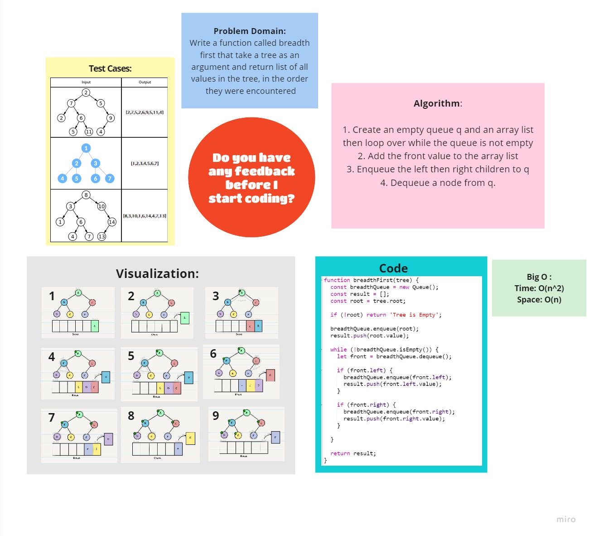

# Challenge Summary
<!-- Description of the challenge -->
Write a function called breadth first that take a tree as an argument and return list of all values in the tree, in the order they were encountered
## Whiteboard Process
<!-- Embedded whiteboard image -->
 

## Approach & Efficiency
<!-- What approach did you take? Why? What is the Big O space/time for this approach? -->

- create an empty queue q and an array list
then loop over while the front is not empty
- add the front value to the array list
- enqueue the left then right children to q
- dequeue a node from q.

### **Big O :**

**Time Complexity : O(n^2)**

**Space Complexity: O(n)**

## Solution
<!-- Show how to run your code, and examples of it in action -->

### [**Code**](./Breadth-first.js)

## [Back To Home](../../../README.md)

