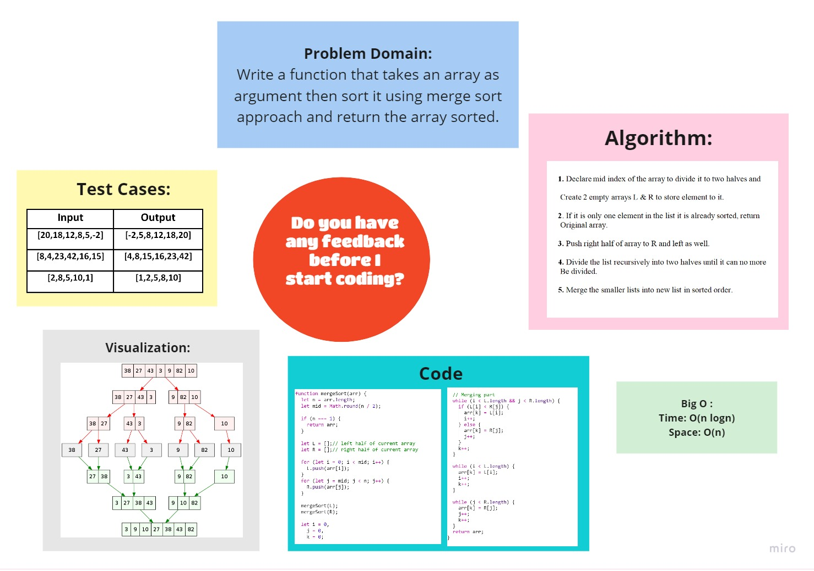

# Challenge Summary
<!-- Description of the challenge -->
Trace the algorithm by stepping through the process with the provided sample array. Document your explanation by creating a blog article that shows the step-by-step output after each iteration through some sort of visual.

Once you are done with your article, code a working, tested implementation of Merge Sort based on the pseudocode provided.

## Whiteboard Process
<!-- Embedded whiteboard image -->

 

## Approach & Efficiency
<!-- What approach did you take? Why? What is the Big O space/time for this approach? -->

- Time: O(n Log n) => quasilinear time

  because merge sort always divides the array in two halves and takes linear time to merge two halves.

- Space: O(n) => linear space

  because we need to create new sub arrays to store elements.

## Solution
<!-- Show how to run your code, and examples of it in action -->

### [**Code**](./mergeSort.js)

## [Back To Home](../../../README.md)
