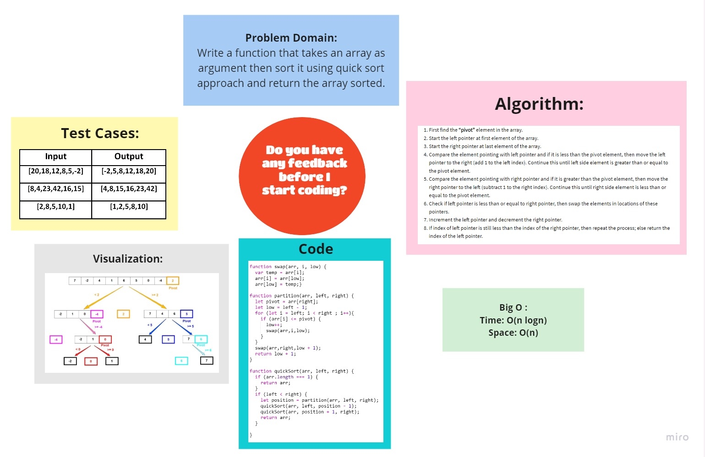

# Challenge Summary
<!-- Description of the challenge -->
Quick sort follows **Divide and Conquer** algorithm. It is dividing elements in to smaller parts based on some condition and performing the sort operations on those divided smaller parts. Hence, it works well for large datasets. So, here are the steps how Quick sort works in simple words.

1. First select an element which is to be called as pivot element.

2. Next, compare all array elements with the selected pivot element and arrange them in such a way that, elements less than the pivot element are to it’s left and greater than pivot is to it’s right.

3. Finally, perform the same operations on left and right side elements to the pivot element.

## Whiteboard Process
<!-- Embedded whiteboard image -->

 

 

## Approach & Efficiency
<!-- What approach did you take? Why? What is the Big O space/time for this approach? -->

Now that we know how to implement the Quicksort algorithm let us discuss the time and space complexity. The worst-case time complexity of Quick Sort is O(n2). The average case time complexity is O(nlogn). The worst-case is usually avoided by using a randomized version of Quicksort.

The weak spot of the Quicksort algorithm is the choice of the pivot. Choosing a bad pivot (one that is greater than/less than most elements) every time, would give us the worst-case time complexity. While repeatedly choosing a pivot that has a roughly equal number of elements that are less than/greater than the pivot would give us a time complexity of O(nlogn).

Quicksort is one of those algorithms where the average-case runtime is actually important. Empirically, it was noticed that Quicksort tends to have a O(nlogn) runtime regardless of the pivot-choosing strategy.

Also, when it comes to space complexity, Quicksort doesn't take any extra space (excluding the space reserved for recursive calls). These kinds of algorithms are technically called as in-place algorithms. We don't need
extra space because we are performing the operation on the same array.

## Solution
<!-- Show how to run your code, and examples of it in action -->

### [**Code**](./quickSort.js)

## [Back To Home](../../../README.md)
